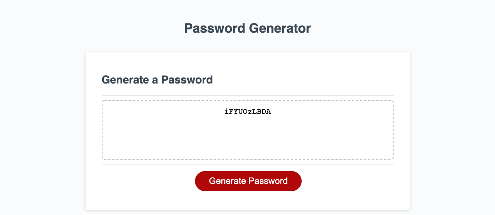

# password-generator
***
This assignment involved developing a password generating application that gives the user the ability to generate a customized password. First, the user can choose how many characters they want their password to be. As long as it's between 8 and 128 characters. Then the user is able to choose if they want their password to have upper case letters, lower case letters, numbers, or special characters. I had to work with functions and use an array. 
***
site: https://armando1236.github.io/password-generator/
Github: https://github.com/armando1236/password-generator.git
***
used JavaScript and HTML on Visual Studio Code
***
